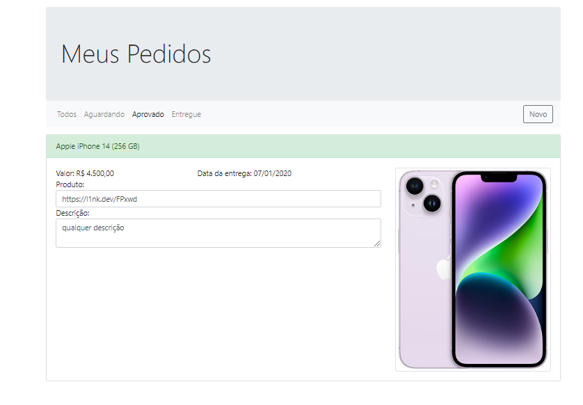
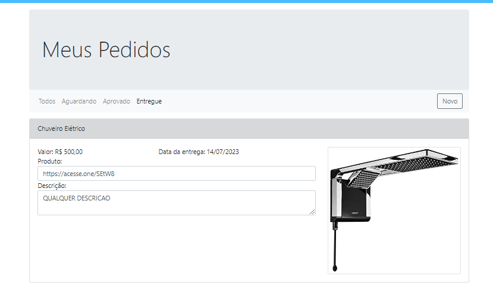
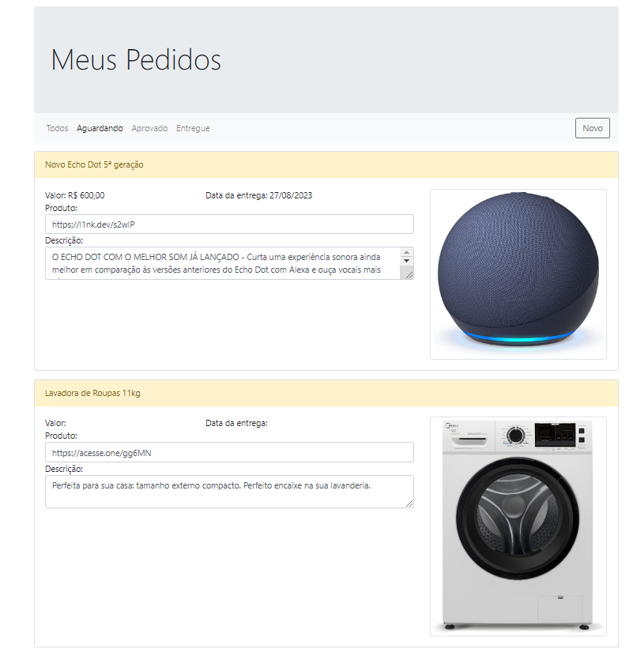

# Projeto Loja Mudi

| :placard: Vitrine.Dev |     |
| -------------  | --- |
| :sparkles: Nome        | **Projeto Loja Mudi**
| :label: Tecnologias | HTML, CSS, Java, Spring Boot, MVC, Data JPA, Thymeleaf, Bootstrap, MySQL, API Rest
| :rocket: URL         | https://github.com/Thamyresmya/Loja-Mudi

 

  <a href="#-tecnologias">Tecnologias</a>&nbsp;&nbsp;&nbsp;|&nbsp;&nbsp;&nbsp;  
  <a href="#-projeto">Projeto</a>&nbsp;&nbsp;&nbsp;|&nbsp;&nbsp;&nbsp;  
  <a href="#-gif">Gif</a>&nbsp;&nbsp;&nbsp;&nbsp;&nbsp;&nbsp;

 

## 🚀 Tecnologias

Esse projeto foi desenvolvido com as seguintes tecnologias:

- HTML
- CSS
- Bootstrap
- Thymeleaf 
- Java
- Spring Boot
- Spring Data
- Spring MVC
- Maven
- API Rest
- MySQL

 

## 💻 Projeto

Projeto de cadastro de produtos desenvolvido em Java com Spring boot. Páginas web dinâmicas utilizando Thymeleaf e Bootstrap, banco de dados MySQL para persistir os dados da aplicação, criação de esquema do banco de dados e tabelas, e utilização do Spring Data JPA para interagir com o banco de dados de forma eficiente.

 

## 📁 Acesso ao projeto

É possível acessar o projeto através do [Link](https://github.com/Thamyresmya/Loja-Mudi)

 

## 📸 Gif

</img>

Lista de todos os produtos  
</img>

Lista dos produtos aprovados 
</img>

Lista dos produtos entregue 
</img>

Lista dos produtos aguardando 
</img>

 

Me siga nas redes sociais:
- [Linkedin](https://www.linkedin.com/in/thamyrescavalcante/)
- [Instagran](https://www.instagram.com/thamyres__cavalcante/)

 

---

Feito com ♥ by Thamyres Cavalcante.

