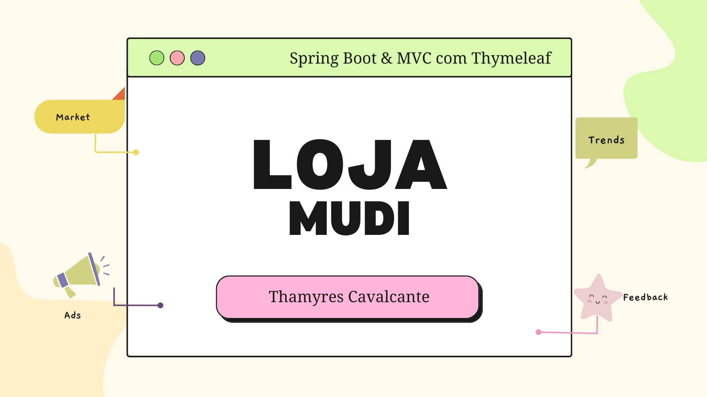
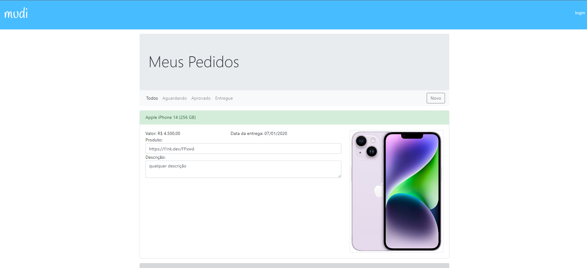

# Projeto Loja Mudi

| :placard: Vitrine.Dev |     |
| -------------  | --- |
| :sparkles: Nome        | **Projeto Loja Mudi**
| :label: Tecnologias | HTML, CSS, Java, Spring Boot, MVC, Security, Data JPA, 
|  | Thymeleaf, MySQL, AJAX
| :rocket: URL         | thamyresmya.github.io/

 

  <a href="#-tecnologias">Tecnologias</a>&nbsp;&nbsp;&nbsp;|&nbsp;&nbsp;&nbsp;  
  <a href="#-projeto">Projeto</a>&nbsp;&nbsp;&nbsp;|&nbsp;&nbsp;&nbsp;  
  <a href="#-gif">Gif</a>&nbsp;&nbsp;&nbsp;&nbsp;&nbsp;&nbsp;

 

## 🚀 Tecnologias

Esse projeto foi desenvolvido com as seguintes tecnologias:

- HTML
- CSS
- Java
- Spring Boot
- Spring MVC
- Spring Security
- API Rest
- AJAX
- Thymeleaf 
- MySQL
- Maven
- Spring Data JPA
- Git e Github

 

## 💻 Projeto

Projeto de cadastro de produtos desenvolvido em Java com Spring boot. Páginas web dinâmicas utilizando Thymeleaf, banco de dados MySQL para persistir os dados da aplicação, criação de esquema do banco de dados e tabelas, controle de versionamento com flyway, e utilização do Spring Data JPA para interagir com o banco de dados de forma eficiente.

 

## 📁 Acesso ao projeto

É possível acessar o projeto através do [Link]()

 

## 📸 Gif

</img>

Lista de todos os produtos

</img>

 

Me siga nas redes sociais:
- [Linkedin](https://www.linkedin.com/in/thamyrescavalcante/)
- [Instagran](https://www.instagram.com/thamyres__cavalcante/)

 

---

Feito com ♥ by Thamyres Cavalcante.

